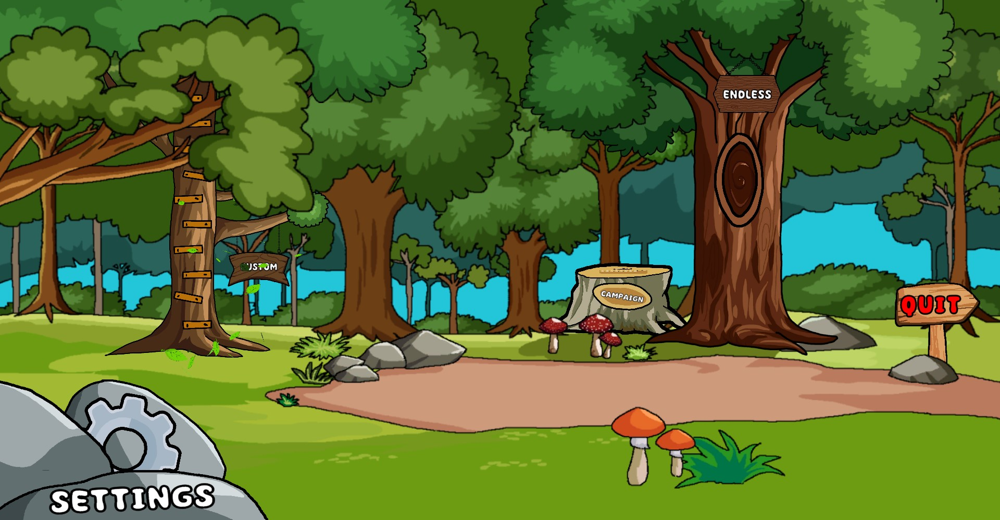

# Jumpin-Jinx

## Overview

This is a 2D platformer Unity game with both campaign and endless game modes. In the campaign mode, players can play through pre-designed levels loaded from a JSON file. The endless mode dynamically generates random levels in chunks as the player progresses, providing infinite gameplay.

The game features various mechanics, power-ups, enemies, and moving platforms to create an engaging and challenging gaming experience. Players can jump, run sideways, use power-ups for jump and run boosts, shoot arrows, and encounter enemies and traps.

### Used technologies:
1. [C#](https://learn.microsoft.com/en-us/dotnet/csharp/)
2. [Unity](https://docs.unity.com/)

### Project Features
    
- **Key Features:**

    - **Campaign Mode:** Play through pre-designed levels loaded from a JSON file.

    - **Endless Mode:** Experience infinite gameplay with dynamically generated random levels.

    - **Engaging Mechanics:** Jump, run sideways, and use power-ups for jump and run boosts.

    - **Combat Arrows:** Use your shooting skills to face a variety of enemies while navigating through traps and moving platforms.

- **Additional Features:**

    - **Easter Eggs:** Discover hidden surprises and easter eggs throughout the game.

    - **Animated Loading Screen:** Enjoy a visually appealing loading screen while levels load.

    - **Language Support:** Play the game in multiple languages (English, Romanian).

    - **User Settings:** Customize the game experience with adjustable settings.
    
        - **Sounds:** Adjust volume levels or mute sound effects and music.
        - **Graphics:** Choose between different graphics quality settings.
        - **Key Binds:** Reconfigure key bindings to suit personal preferences.

### How to Run the Project?
1. Clone the [Repo](https://github.com/CatalinCatta/Jumpin-Jinx.git).
2. Run \Builds\Pc\Jumpin'Jinx\Jumpin'Jinx.exe
3. Have Fun!

## Gameplay

